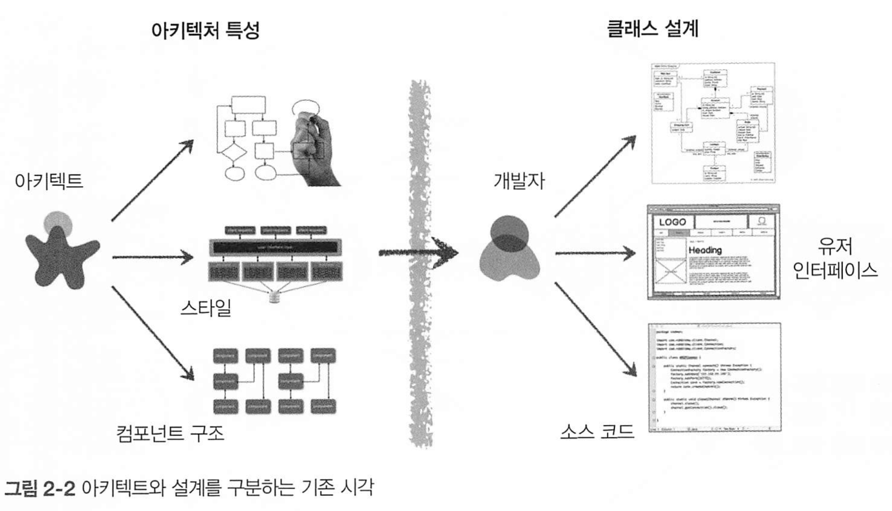
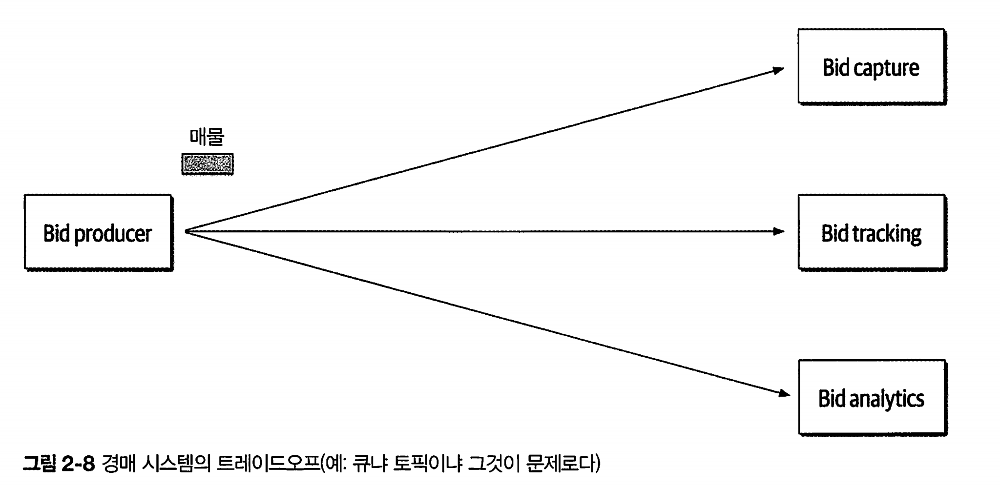
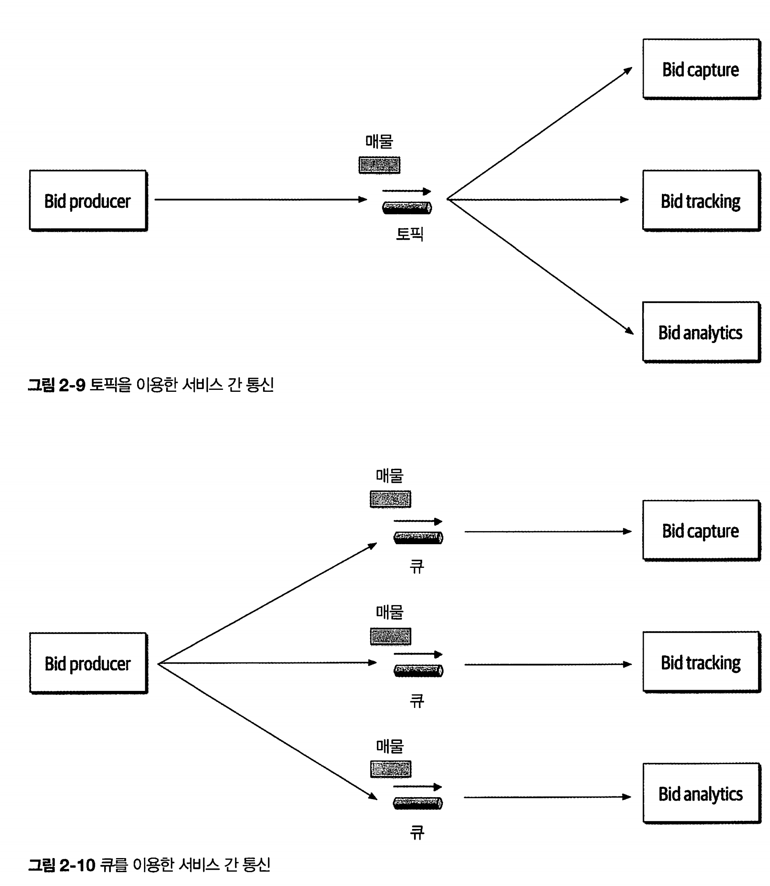

# 2. 아키텍처 사고

아키텍트의 사고방식은 4가지로 나뉨

1. 아키텍처와 설계의 차이를 이해하고 개발팀과 협력해야 할지 고민하는것
2. 어느정도 기술 깊이를 유지하면서 폭넓은 기술 지식 확보해야 한다
3. 다양한 솔루션과 기술 간의 트레이드 오프를 이해하고 분석하고 조율하는것
4. 비즈니스 driver의 중요성을 이해하고 아키텍처 관심사로 해석해야 함 

## 2.1 아키텍처 대 설계

아키텍처와 설계의 차이점은 모호함. 

아키텍트처럼 사고한다는 건, 비즈니스와 기술 문제를 해결하기 위해 아키텍처와 설계의 차이점을 알고 이 둘을 긴밀하게 통합한 솔루션을 모색하는것 

| 구분            | 아키텍처 (Architecture)                                      | 설계 (Design)                           |
| --------------- | ------------------------------------------------------------ | --------------------------------------- |
| **목적**        | 시스템의 **구조와 큰 방향**을 정의                           | 구체적인 **구현 방법**을 정의           |
| **추상화 수준** | 고수준(High-level)                                           | 저수준(Low-level)                       |
| **관심사**      | **무엇을** 만들 것인가, 어떤 구성요소로, 어떻게 연결할 것인가 | **어떻게** 구현할 것인가                |
| **범위**        | 전체 시스템 또는 주요 서브시스템                             | 모듈, 클래스, 함수 등 세부 구조         |
| **결정 요소**   | 기술 스택, 시스템 구성, 통신 방식, 배포 전략, 품질 속성(Quality Attributes) | 자료구조, 알고리즘, API 명세, 코드 구조 |
| **변경 비용**   | 변경 비용이 크고 파급력이 큼                                 | 상대적으로 변경 비용이 낮음             |
| **예시**        | - 마이크로서비스 vs 모놀리식                                 |                                         |

아키텍트의 책임과 개발자의 책임을 보자

그림을 보면, 둘이 생각하는것이 다르다는것을 알 수 있다. 때문에 이둘 사이에 가상의 물리적 장벽이 있다.

때문에 이 장벽을 허물고, 개발자와 아키텍트 모두 활발히 소통할 수 있도록 동일한 팀에 소속되어야 한다.

## 기술 폭

개발자보다 훨씬 넓고 깊은 기술 폭을 갖고있어야 한다.

지식을 3가지로 나눠보자

* 내가 알고 있는것
* 내가 모른다는 사실을 아는것
* 내가 모른다는 사실조차 모르는것

아키텍트는, 한가지 문제만 해결가능한 전문지식보다는 다섯가지 이상의 솔루션을 알고있어야 한다. 

즉 내가 모른다는 사실조차 모르는것을 줄여나가야 하는것이다. -> 폭이 넓어야 하는것.

## 트레이드오프 분석 

아키텍처는 모든게 트레이드오프여서, 경우에따라 다르다.

* REST와 메시징 중 어느것이 나은지
* 마이크로서비스가 맞는 아키텍처인지 등

* 경매 시스템의 큐냐 토픽이냐의 트레이드 오프 예시

큐를 이용한 점대점 메시징, 토픽을 사용한 메시지/구독 방식도 둘다 가능.

큐를 이용하면, 프로듀서가 세 큐에 접속해야 하지만, 토픽을 이용하면 한토픽에 한번만 연결하면 된다. 

요점은, 프로듀서가 큐 방식을 쓰게된다면 새로운 입찰 기능을 추가할 경우 큐 사용시 작업 변경이 필요하지만 토픽은 그럴 필요가 없다. 또한 토픽 방식은 커플링이 덜된다. 

그럼 토픽의 단점은 무엇일가?

큐는 지정된 컨슈머만 액세스 가능하므로, 악의적인 서비스가 리스닝할 수 없다. 하지만 토픽은 도청하기가 쉽다.

또한 토픽은 메시지 개수를 모니터링하기어렵고 오토스케일링도 어렵다. 하지만 큐는 각 큐를 모니터링할 수 있으며, 각 큐의 컨슈머마다 로드 밸런싱이 가능하다. 

| 구분            | 토픽(발행/구독)                | 큐(포인트-투-포인트)               |
| --------------- | ------------------------------ | ---------------------------------- |
| 확장성/디커플링 | 매우 좋음(새 컨슈머 그룹 추가) | 낮음(새 플로우마다 라우팅/큐 필요) |
| 재생/히스토리   | 좋음(오프셋 재생, ETL 유리)    | 약함(소비 후 소멸, 별도 저장 필요) |
| 순서 보장       | 파티션 키 범위 내              | 전역/큐 단위(단일 소비 시)         |
| 모니터링 지표   | **Lag 중심**                   | 큐 길이/처리율 중심                |
| 오토스케일      | Lag 기반 스케일(구성 필요)     | 큐 길이 기반 스케일 간단           |
| 보안/격리       | ACL/TLS 필수, 구독 면 넓음     | vhost/큐 권한으로 경계 선명        |
| 계약/스키마     | **진화·호환 규칙 중요**        | 상대적으로 단순                    |

 “큐 vs 토픽”은 사실 **전달 패턴(point-to-point) vs 발행/구독(pub/sub)**의 선택에 가깝고, 구현체(예: RabbitMQ, Kafka)에 따라 디테일이 다르다.

 장단점 비교 표

| 구분          | 토픽(발행/구독)                                              | 큐(포인트-투-포인트)                                         |
| ------------- | ------------------------------------------------------------ | ------------------------------------------------------------ |
| **장점**      | - **디커플링/확장성**: 신규 기능 시 컨슈머 그룹만 추가, 프로듀서 변경 없음  - **재생/백필(Replay)**: 오프셋 기반 재처리 가능, 데이터 파이프라인·모델 재학습 유리  - **멀티 뷰**: 동일 이벤트로 알림, 집계, 감사 로그 등 병행 가능  - **압축(Log Compaction)**: 최신 상태만 유지 가능(구현체 의존) | - **단일 책임 작업 처리**: 이미지 변환, 결제 후 후처리 등 작업형 워크로드 최적  - **간단한 로드밸런싱**: 컨슈머 인스턴스 수만 늘려도 처리량 증가  - **명확한 보안 경계**: 큐 단위 접근 제어, 내부 파이프라인 적합  - **재시도/지연큐/DLQ**: 실패 격리·회복 시나리오 표준화 |
| **단점/주의** | - **보안**: “쉽게 도청”은 아니지만 구독자가 늘수록 접근면 넓어짐 → ACL/TLS/VPC 필요 -  **계약 관리**: 스키마 진화·버전 호환 필요, 호환 규칙 강제 필요  - **모니터링/오토스케일링**: 메시지 개수 대신 **Lag** 기반, 구성 난이도 있음  - **순서/키 설계**: 글로벌 순서 보장 어려움, 파티션 키 단위 순서 설계 필요 | - **팬아웃 어려움**: 같은 메시지를 여러 시스템이 모두 받게 하려면 큐 복제/라우팅 필요  - **재생/백필 약함**: 소비 후 소멸, 과거 이벤트 재처리 어려움  - **기능 추가 비용**: 새로운 소비 플로우마다 라우팅/바인딩 설계 변경 필요 |

빠른 결정 가이드

- “**같은 메시지를 여러 팀이 각자 써야 하나?**” → 예: **토픽** / 아니오: **큐**
- “**과거 이벤트 재생/재처리**가 중요한가?” → 예: **토픽**
- “**한 번만 처리되는 작업형**이고 단순 스케일이면?” → **큐**
- “**엄격한 순서 보장**이 필요한가?” → **토픽(키 단위 순서)** 또는 **단일 소비 큐**로 직관적 보장
- “**스키마/계약 통제** 능력이 있는가?” → 있다면 토픽 확장성↑, 없으면 큐로 경계 축소

## **비즈니스 동인(Business Driver)**

 말 그대로 **비즈니스를 움직이게 만드는 핵심 원인·요인·필요성**

이것을 이해하고, 도메인 지식으로 가다듬어 아키텍처 특성으로 만들어야 한다. 