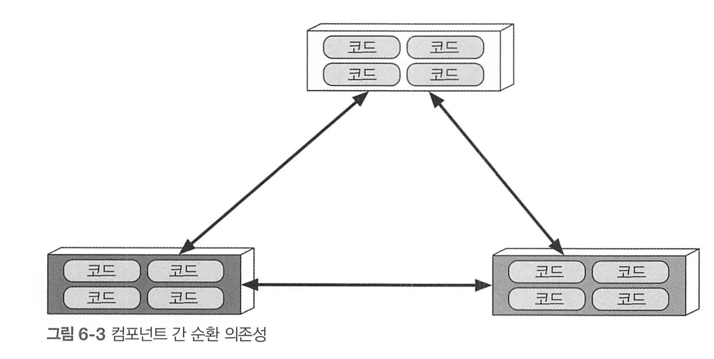

# 6 아키텍처 특성의 측정 및 거버넌스

## 아키텍처 특성 측정

### 6.1.1 운영적 측정

아키텍처 특성은 성능, 확장성처럼 정확하게 측정하 수 있는것도 있지만 팀 목표에 따라 갈릴수도 있음. 

수준 높은 팀은, 달성하기 어려운 성능 수치 정하는 대신 통계 분석 결과로 얻은 각각 서비스마다의 정의에 기반함. 

### 순환 의존성

모듈성은 반드시 필요한 암묵적 아키텍처 특성인데, 모듈성이 제대로 유지되지 못하면 코드 베이스 구조에 해를 끼친다.

모듈성을 이용하면 임포트가 반드시 필요하지만, 이것저것 마구마구 임포트하는건 정말 좋지 않다. 



이런식으로 컴포넌트가 마구잡이로 의존하면 특정 컴포넌트를 재사용하기위해 함께 가져와야 하므로 매우 모듈성이 떨어진다. 이런 것들을 검증하는 것으로 archunit이라는 도구가 있다.

단위 테스트로 규칙을 정하고 모듈성에 특화된 테스트를 작성할 수 있다.

```kotlin
layeredArchitecture()
    // Layer 정의
    .layer("Controller").definedBy("..controller..")
    .layer("Service").definedBy("..service..")
    .layer("Persistence").definedBy("..persistence..")

    // 접근 규칙 정의
    .whereLayer("Controller")
        .mayNotBeAccessedByAnyLayer()

    .whereLayer("Service")
        .mayOnlyBeAccessedByLayers("Controller")

    .whereLayer("Persistence")
        .mayOnlyBeAccessedByLayers("Service");

```

* 넷플릭스는 AWS로 인프라를 이전하면서.. AWS의 장애를 대비해 도구를 만들어 테스트도 했다고 한다..