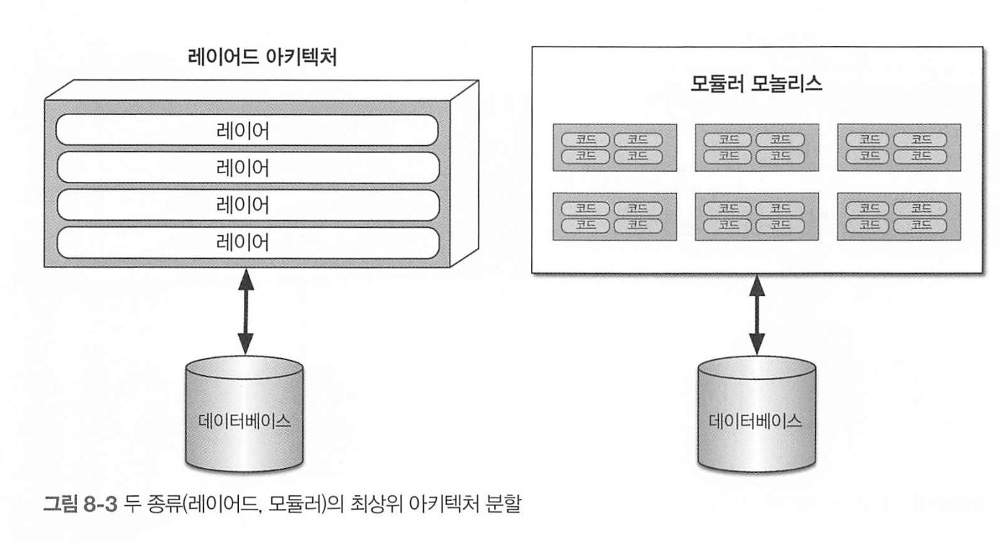
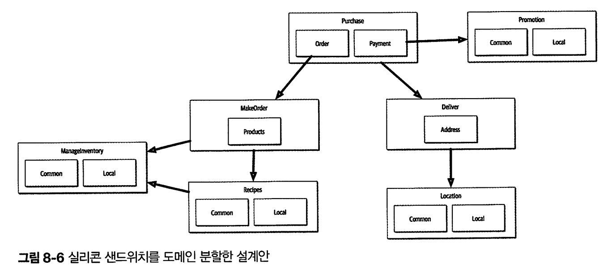
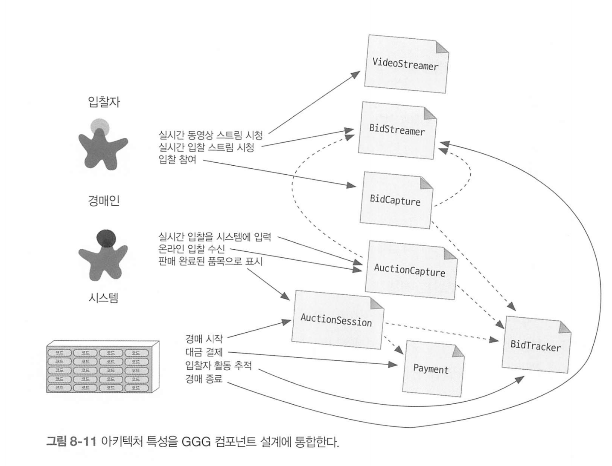

# 8장 컴포넌트 기반 사고

## 컴포넌트 범위

1. 모듈과 컴포넌트의 관계

- **모듈(module)**: 연관된 코드 묶음.
- **컴포넌트(component)**: 모듈을 물리적으로 패키징한 결과물.
  - 예시: Java `jar`, .NET `dll`, Ruby `gem`.
- 아키텍트는 보통 컴포넌트를 **아키텍처 단위(배포 단위)**로 바라봄.

2. 컴포넌트 범위

컴포넌트는 언어와 플랫폼에 따라 다양하게 구현되며, 크게 두 가지로 나뉜다.

(1) 라이브러리 형태

- 클래스/함수보다 한 단계 높은 수준의 모듈 래핑.
- 보통 **라이브러리(library, binary)**라고 부름.
- 특징:
  - 호출부 코드와 동일한 메모리 공간에서 실행됨.
  - 함수 호출 메커니즘으로 통신.
  - 대부분 **컴파일 타임 의존성**.
  - 예외: Windows DLL(동적 링크 라이브러리) 같은 런타임 의존성.

(2) 서비스 형태

- 독립 실행 공간에서 동작.
- 네트워크 프로토콜(TCP/IP, REST, 메시지 큐 등)로 통신.
- 예: 마이크로서비스 → 배포 가능한 독립 단위.

3. 아키텍처에서의 컴포넌트

- 컴포넌트는 **서브시스템이나 레이어**로 표현될 수 있음.
- 이벤트 프로세서, 배포 단위, 서비스 등 다양한 모습으로 사용됨.
- **마이크로서비스 아키텍처**에서는 단순성을 위해:
  - 컴포넌트가 충분한 코드를 담을 수 있음.
  - 혹은 최소한의 코드만 갖고 단순하게 설계하기도 함.

4. 아키텍트에게 중요한 이유

- 컴포넌트는 아키텍처 **모듈성(modularity)**의 핵심 요소.
- 아키텍트가 결정하는 가장 중요한 일 중 하나가
   **최상위 컴포넌트 분할**을 정의하는 것.
- 즉, **무엇을 어디까지 하나의 컴포넌트로 묶을 것인지**가
   시스템의 구조와 배포 전략을 크게 좌우함.

## 8.2 아키텍트 역할

- **핵심 업무**: 아키텍처 내부 컴포넌트 정의, 개선, 관리, 통제.
- **협업 대상**: 비즈니스 분석가, 도메인 전문가, 개발자, QA, 운영자, 엔터프라이즈 아키텍트 등과 함께 초기 설계 수행.

- 아키텍처는 개발 프로세스와 **대체로 독립적**. (예: 폭포수, JAD, 애자일 스토리 카드와 무관)
- 예외: **배포 및 자동화 거버넌스** 같은 애자일 엔지니어링 프랙티스 영역.
- 아키텍트는 클래스 설계·구현에 직접 관여하지 않음 → 개발자·기술리더의 영역.
  - 권한을 과도하게 독점하면 조직은 차세대 아키텍트에게 자율권을 주기 어려움.
  - 개발자도 자유를 뺏기므로, 업무에 어려움이 있음. 

### 아키텍처 분할

- **소프트웨어 아키텍처 제1법칙**: 모든 것은 트레이드오프.
- 컴포넌트 분할도 트레이드오프의 일종이며, 아키텍트는 다양한 **최상위 분할 방식** 중 선택해야 함.

두 종류의 아키텍처 분할.

레이어드 아키텍처 (Presentation / Business / Service / Persistence). 분할

- **장점**:
  - 기술별 코드가 모여 있어 찾기 쉽다. (레포지토리는 퍼시스턴스에 있기 때문)
  - MVC 패턴과 잘 맞음, 조직 내 역할 분담(백엔드, DBA, 프런트엔드)과 일치.
    - 백엔드를 모두 한곳에 앉히고 옆에는 DBA등 기능 조직으로 구분하기 쉬움. 
  - 관심사 분리로 적절한 디커플링 가능.
- **단점**:
  - 워크플로(예: CatalogCheckout)가 여러 레이어에 흩어짐.
  - 현실 세계의 비즈니스 흐름과 불일치.
  - 변경 요구가 발생했을 때 여러 레이어에 걸쳐 수정 필요.

> 콘웨이의 법칙
>
> - “시스템 설계는 조직의 커뮤니케이션 구조를 반영할 수밖에 없다.”
>
>   → 조직 구조가 아키텍처 형태에 큰 영향을 미침.
>
>   * 구성원 간 소통 구조에 설계 결과에 반영됌. 
>   * ex) 기술 역량에 따라 부서를 다르게 배치함. 
>
> - **역 콘웨이 전략(Reverse Conway Maneuver)**:
>
>   아키텍처에 맞는 팀 구조를 설계하여 바람직한 아키텍처를 유도.

**도메인 분할 (Domain Partitioning)**

- **예시**: 모듈러 모놀리스, DDD 기반 분할.
- 워크플로/도메인 중심으로 컴포넌트를 정의 (예: CatalogCheckout, Purchase, Delivery).
  - 마이크로 서비스 아키텍처의 근본 사상 
- **장점**:
  - 비즈니스 기능에 밀접.
  - **역 콘웨이 전략** 활용 가능 → 도메인별 다기능 팀 구성 용이.
  - 모듈러 모놀리스·마이크로서비스 아키텍처와 자연스럽게 연결.
  - 메시지 흐름이 문제 영역과 일치.
  - 분산 아키텍처로 전환하기 유리.
- **단점**:
  - 사용자 정의 코드가 분산되어 관리 복잡.
  - 중복 가능성.

두 사례중 어느것이 낫다고 단정지을수는 없다. 아키텍트가 상황에 맞게 분리해야 한다. 

### **분할 사례 연구: 실리콘 샌드위치**

- **도메인 분할 방식**: Purchase, Promotion, MakeOrder, ManageInventory, Recipes, Delivery, Location 컴포넌트로 나눔.

- **기술 분할 방식**: Common / Local 같은 커스터마이징 단위로 분할.

- **트레이드오프**:

  - 도메인 분할 
    - 장점
      - 비즈니스와 가깝고 마이크로서비스 전환 용이.
      - 역 콘웨이 전략을 이용하여 도메인별 팀 구성 가능 
      - 메시지 흐름이 문제 영역과 일치함 
      - 데이터와 컴포넌트를 분산 아키텍처로 옮기기 쉬움
    - 단점
      - 유저 정의 코드가 여기저기 널려있음
  - 기술 분할 → 커스텀 코드 분리 명확, 레이어드 아키텍처 친화적.
    - 단점
      - 공통 또는 로컬 컴포넌트가 변경되면 다른 모든 컴포넌트가 영향을 받음
      - 공통 레이어에 도메인 개념을 복제해야 할수도 있음. 
      - 분산 시스템으로 아키텍처를 변경하려 할 경우, 데이터 관계를 파헤치는 작업이 복잡해짐 
  - 둘 다 장단점이 있으며, “상황에 따라 다르다”가 정답.

  ## 8.6 컴포넌트 설계

  컴포넌트 설계는 애플리케이션을 구성할 굵직한 요소를 그려봐야 함.

  컴포넌트를 발견하는 몇가지 일반적인 방법과 하지말아야 할 사항을 구분해보자

  ### 컴포넌트 발견 

아키텍트는 개발자, 비즈니스 분석가, 도메인 전문가와 협력해서 시스템에 관한 지식과 시스템을 어떻게 분할할지 결정하고 그에 따라 초기 컴포넌트 설계를 한다. 

아래 함정을 주의하자.

**(1) 엔티티 함정 (Entity Trap) ❌ (피해야 할 안티패턴)**

- **잘못된 접근**: DB 엔티티(테이블)마다 컴포넌트를 하나씩 만드는 방식.
  - 예: User 테이블 → UserManager 컴포넌트, Order 테이블 → OrderManager 컴포넌트.
- 문제점:
  - 단순 CRUD만 구현된 “데이터 중심” 구조.
  - 실제 비즈니스 워크플로 반영 ❌.
  - 코드 구조가 커다란 덩어리로만 나뉘어서 아키텍처적 지침이 전혀 없음.
- 결론 → “DB = 아키텍처”로 착각하는 것. 반드시 피해야 함.

**(2) 액터/액션 접근법 (Actor/Action Approach)**

- 요구사항에 등장하는 **사용자(Actor)** 와 **행동(Action)** 을 기준으로 컴포넌트 정의.
- 예: “고객(Customer)”이 “상품 구매(Purchase)”를 한다 → Purchase 컴포넌트.
- 장점:
  - 역할과 행동이 명확할 때 효과적.
  - 워크플로와 요구사항이 잘 드러남.
  - 모놀리식, 분산 시스템 등 어떤 아키텍처에도 적용 가능.
- 주로 **전통적 프로세스(폭포수, 선행 설계 등)** 와 잘 어울림.

**(3) 이벤트 스토밍 (Event Storming) ✔️**

- **DDD(도메인 주도 설계)** 기반 방법.
- 시스템에서 발생하는 **이벤트(사건)** 를 식별하고, 그 이벤트를 처리하는 **핸들러**를 중심으로 컴포넌트 설계.
- 예: “주문됨(OrderPlaced)” 이벤트 → Order 컴포넌트가 이를 처리.
- 장점:
  - 마이크로서비스, 메시징 기반 아키텍처에 잘 맞음.
  - 최종 일관성(Eventual Consistency) 시스템 설계에 도움 됨.
- 분산 아키텍처에서 특히 효과적.

**(4) 워크플로 접근법 (Workflow Approach) ✔️**

- 이벤트 스토밍과 비슷하지만, 꼭 메시지 기반일 필요는 없음.
- **주요 역할**과 **워크플로 단계**를 중심으로 컴포넌트 정의.
- 예: “재고 확인 → 결제 → 배송” 과 같은 워크플로 단계를 기준으로 컴포넌트 분리.
- 장점:
  - 범용적이고 다양한 아키텍처에서 적용 가능.
  - 이벤트가 없는 전통적 환경에서도 사용 가능.

**어떤 방법을 언제 쓸까?**

- **단순 CRUD만 필요하다** → 굳이 아키텍트가 복잡하게 나눌 필요 없음.
- **전통적 개발 프로세스(폭포수, 선행 설계)** → 액터/액션 접근법이 잘 맞음.
- **DDD + 마이크로서비스** → 이벤트 스토밍이 최적.
- **메시지 기반 아니고 일반 워크플로** → 워크플로 접근법 적합.

결론

- **DB 엔티티 = 컴포넌트** 로 만드는 건 절대 금물.
- **액터/액션, 이벤트 스토밍, 워크플로** 같은 방식으로 **실제 업무 흐름과 맞는 컴포넌트**를 설계해야 한다.
- 아키텍트의 목표는 단순 CRUD가 아니라, **비즈니스와 시스템의 흐름을 반영하는 큰 덩어리(컴포넌트) 설계**다.

## **8.8 아키텍처 퀀텀 딜레마**

아키텍트가 **모놀리식 아키텍처**로 갈지, **분산 아키텍처(예: 마이크로서비스)**로 갈지 결정하는 기준.

- **아키텍처 퀀텀(Architecture Quantum)**:

  하나의 **아키텍처 특성(성능, 확장성, 보안, 가용성 등)** 세트가 적용되는 단위.

- 즉, **하나의 퀀텀은 그 자체로 완결된 아키텍처 특성 집합**을 가짐.

### 선택의 갈림길: 모놀리식 vs 분산

**(1) 모놀리식 아키텍처**

- 배포 단위: **하나**
- 데이터베이스: **단일 DB**
- 시스템 기능: 모두 하나의 배포물 안에서 실행
- 장점:
  - 단순함 (개발·테스트·배포가 간단)
  - 일관된 데이터 관리
  - 성능 측면에서 네트워크 오버헤드 없음
- 적용 기준: **시스템이 단일 퀀텀으로 충분한 경우**

**(2) 분산 아키텍처**

- 배포 단위: **여러 개** (서비스별로 나눔)
- 각 서비스: 독립된 체계(코드 + 데이터) 보유
- 통신: 네트워크 프로토콜(TCP/IP, REST, 메시지 큐 등)
- 팀 운영: 서비스별로 **자체 릴리스 주기와 우선순위** 설정 가능
- 장점:
  - 서비스별 특성(확장성, 보안, 성능 요구 등)을 독립적으로 적용 가능
  - 병렬 개발과 빠른 배포 주기 가능
- 적용 기준: **여러 퀀텀(다른 아키텍처 특성)을 필요로 할 때**

**3. 사례**

- 예: **Videostreamer** vs **Bidstreamer**
  - 둘 다 “입찰자에게 읽기 전용 뷰 제공”이라는 공통 기능 있음.
  - 하지만 특성이 다름:
    - Videostreamer → **읽기 전용 스트리밍**에 최적화 필요.
    - Bidstreamer → **대용량 업데이트**와 혼합되면 성능 저하.
  - 서로 다른 아키텍처 특성을 요구하므로 → **분산 아키텍처 선택**이 타당.

즉 **아키텍처 퀀텀 = 설계의 기준 단위**.

- 퀀텀이 하나라면 → 모놀리식 아키텍처.

- 퀀텀이 여러 개라면 → 분산 아키텍처.

  → 결국, **아키텍처 선택은 퀀텀 분석에 달려 있다**.

